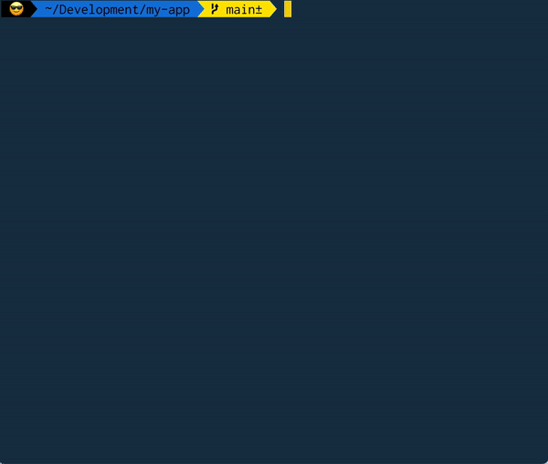

# Lintier

   

Lintier is a script to quickly and easily scaffold an [ESLint](https://eslint.org/) & [Prettier](https://prettier.io/) setup in a [TypeScript](https://www.typescriptlang.org/) project.  Because linting and code formatting are essential in every project, but setup is a pain.

Lintier works in React, Node, and vanilla Typescript projects. It provides options to install the [airbnb styleguide](https://github.com/iamturns/eslint-config-airbnb-typescript), [stylelint](https://stylelint.io/) for linting styles, and [lint-staged](https://github.com/okonet/lint-staged#readme) for linting pre-commit. Lintier will install the dependencies, create the config files, and add linting scripts to your `package.json` file.

Lintier's goal is to provide a minimal setup to build upon.  A few rules are included by default, but you should modify the config files to fit your project's needs.

## Usage

Just run `npx lintier` in your project's directory.  Linter will start in interactive mode, letting you choose your project type and configuration.

Alternately, you can specify any of the options below to skip the interactive prompts:

  |Options                 |Description
  -------------------------|-------------------------
  |-r, --react             |install react dependencies
  |-n, --node              |install node dependencies
  |-a, --airBnb            |install airbnb styleguide
  |-s, --styleLint         |install stylelint
  |-c, --styledComponents  |install styled-components lint script
  |-p, --sass              |install sass stylelint config & lint script
  |-l, --lintStaged        |install lint-staged and simple-git-hooks
  |--help                  |display help for command
  |-V, --version           |output the version number

### A Note on Styled-Components

The styled-components option just adds .ts/.js files to the package.json script to lint styles.  The stylelint config mentioned in the [styled-components docs](https://styled-components.com/docs/tooling#stylelint) seems to conflict with this eslint setup, so I left it out for now.

## Troubleshooting

Lintier installs the latest version of the various dependencies, and versions are not pinned.  This helps me keep the package up-to-date as I use it, but it also means breaking changes in those dependencies can break lintier.  A weekly scheduled end-to-end test is also setup to help catch these changes.

If you spot trouble, please open an issue in the GitHub repo.

## Contributing

Pull requests are welcome!  The goal is to keep lintier minimalist, so please minimize any additional rules enabled and options presented to the user.

